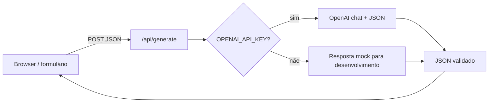

# Passo 2 — Arquitetura técnica (MVP)

Este documento fixa **stack**, **fluxo de dados**, **contrato da API** e **provedor de IA** para o Gerador de Anúncios.

---

## 1. Stack escolhida

| Camada | Escolha | Motivo |
|--------|---------|--------|
| Framework full-stack | **Next.js 14** (App Router) | UI + rotas API no mesmo projeto, deploy simples (Vercel ou Node), ecossistema maduro. |
| Linguagem | **JavaScript** | Alinhado ao repositório atual; TypeScript pode ser adicionado depois. |
| IA | **OpenAI API** (`openai` SDK) | API estável, `response_format: json_object` para saída estruturada; fácil trocar modelo ou provedor depois. |
| Configuração | **Variáveis de ambiente** | Segredos só em `.env.local` (não versionado). |

---

## 2. Fluxo (formulário → API → JSON)



1. O cliente envia **`POST /api/generate`** com o corpo descrito abaixo.
2. O servidor monta um **prompt** (regras Meta/Google + limites de caracteres + dados do formulário).
3. A resposta da IA é forçada a **JSON** (`json_object`).
4. O servidor devolve o objeto ao cliente; em desenvolvimento **sem chave**, devolve um **mock** para permitir trabalhar no Passo 3 sem custo de API.

---

## 3. Variáveis de ambiente

| Variável | Obrigatória | Descrição |
|----------|-------------|-----------|
| `OPENAI_API_KEY` | Não (MVP local) | Chave da OpenAI. Sem ela, a rota usa resposta **mock**. |
| `OPENAI_MODEL` | Não | Default: `gpt-4o-mini`. |

Copiar `.env.example` para `.env.local` e preencher a chave.

---

## 4. Contrato `POST /api/generate`

### Pedido (body JSON)

| Campo | Tipo | Obrigatório | Descrição |
|-------|------|-------------|-----------|
| `productName` | string | sim | Nome do produto ou serviço |
| `valueProposition` | string | sim | Proposta de valor (o que resolve) |
| `audience` | string | sim | Público-alvo |
| `offer` | string | sim | Oferta, preço, promoção, prova social |
| `tone` | string | sim | Tom de voz |
| `language` | string | sim | Ex.: `pt-BR`, `pt-PT`, `en` |
| `platforms` | string ou string[] | não | `meta`, `google`, `both` ou `["meta","google"]`. Default: `both` |
| `variationCount` | number | não | Número de variações por plataforma (1–5). Default: 3 |

### Resposta (200)

Objeto JSON com:

- `mock` — `true` se foi usada resposta simulada (sem `OPENAI_API_KEY`).
- `meta` — presente se Meta pedido; contém `variations[]` com campos de texto para anúncios.
- `google` — idem para Google (headlines, descriptions, keywords sugeridas).
- `limits` — referência aos limites de caracteres usados no prompt (documentação para a UI).
- `disclaimer` — aviso sobre políticas de anúncios e revisão humana.

Erros: **400** (validação), **500** (falha OpenAI ou JSON inválido).

---

## 5. Limites de caracteres (referência no código)

Valores aproximados usados nos prompts (ajustáveis em `lib/limits.js`):

- **Meta (feed comum):** texto principal até ~125 caracteres (recomendado); título ~40; descrição ~30.
- **Google (RSA):** headlines até 30 caracteres cada; descrições até 90.

A IA é instruída a respeitar estes limites; a UI (Passo 3) pode truncar ou avisar se necessário.

---

## 6. Estrutura de pastas (relevante)

```
app/
  api/generate/route.js   # POST — orquestra validação + IA
  layout.js
  page.js                 # placeholder até ao Passo 3
  globals.css
lib/
  ai.js                   # Chamada OpenAI + fallback mock
  limits.js               # Constantes de caracteres
  prompts.js              # Montagem do system/user prompt
  mock-response.js        # JSON de exemplo
```

---

## 7. Próximo passo (Passo 3)

Interface: formulário alinhado a `PRODUTO.md`, chamada a `POST /api/generate`, listagem de variações, botões copiar e mensagem de políticas.
